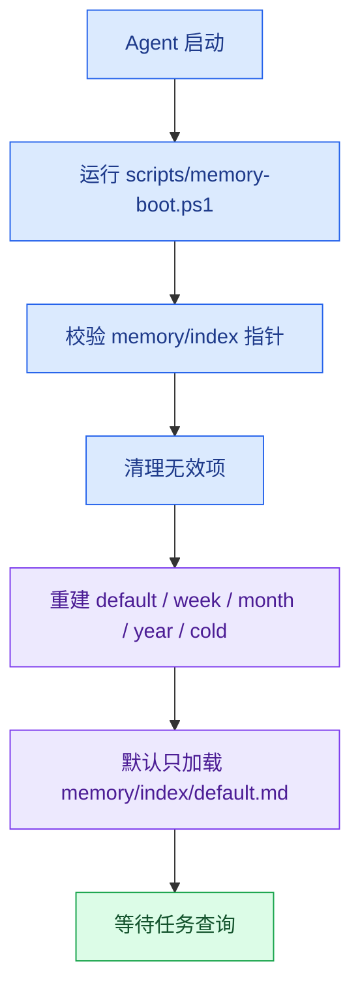
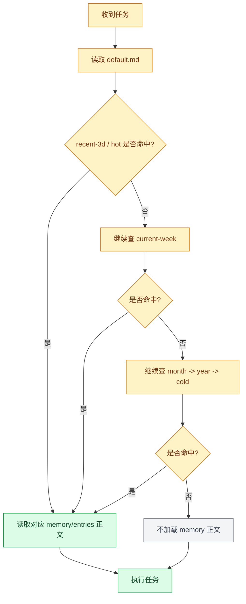
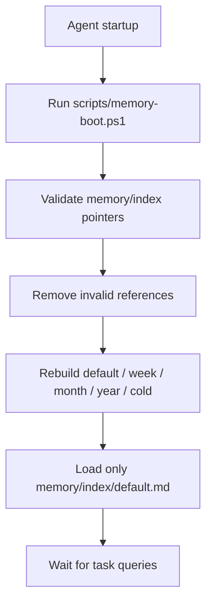
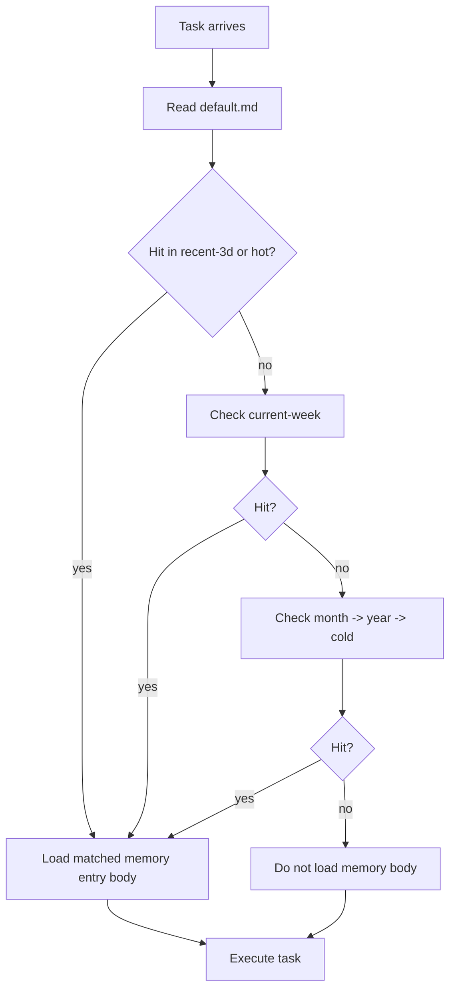
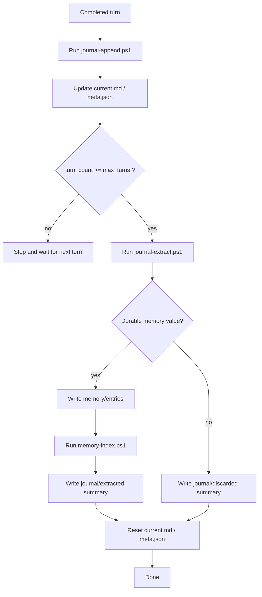

<div align="right">

[中文](#中文) | [English](#english)

</div>

## 中文

# Mnemonic Kernel

**Mnemonic Kernel** 是一套面向 AI Agent 的上下文、长期记忆、技能流程和交互缓冲治理骨架。

它解决的不是“记住更多”，而是“只保存值得保留的内容，并且只在需要时加载最小上下文”。

## 它到底在做什么

Mnemonic Kernel 把 Agent 的持久化上下文拆成 4 层：

```text
AGENTS.md  = 硬规则、索引入口、默认加载边界
memory     = 长期有效的事实、偏好、规则、排障经验
skills     = 可重复执行的稳定流程
journal    = 短期交互缓冲，作为 memory 的提炼来源
```

这 4 层的关键区别是：

- `AGENTS.md` 只放所有任务都必须知道的规则。
- `memory` 存长期有效内容，但默认只读索引，不读正文。
- `skills` 存稳定流程，但默认只读技能索引，不读具体 skill body。
- `journal` 只保留最近交互批次，不长期保留完整对话。

## 运行机制

系统运行时有 3 条主链路：

1. 启动链路
   `memory-boot.ps1` 校验索引指针、清理无效项、重建 memory 索引。
2. 查询链路
   Agent 先读 `memory/index/default.md`，只有命中索引才读取对应 entry 正文。
3. 提炼链路
   每轮交互先写入 `journal/buffer`，到阈值后再由 `journal-extract.ps1` 判断是否沉淀成 memory。

## 推荐目录结构

```text
Mnemonic Kernel/
├── AGENTS.md
├── README.md
├── memory/
│   ├── memory.md
│   ├── index/
│   │   ├── default.md
│   │   ├── current-week.md
│   │   ├── month-YYYY-MM.md
│   │   ├── year-YYYY.md
│   │   ├── cold.md
│   │   └── master.md
│   ├── entries/
│   │   └── YYYY-MM-DD/
│   │       └── HHmm-slug.md
│   ├── review/
│   └── reports/
├── skills/
│   ├── skills.md
│   └── example-skill/
├── journal/
│   ├── buffer/
│   │   ├── current.md
│   │   └── meta.json
│   ├── extracted/
│   ├── discarded/
│   ├── reports/
│   │   └── extract-report.md
│   └── README.md
├── templates/
├── scripts/
└── tests/
```

## Memory 机制

### 默认加载规则

- 启动后默认只加载 `memory/index/default.md`。
- `memory/index/*.md` 只保存指针和元数据，不保存正文。
- `memory/entries/` 只在索引命中后读取。
- 禁止默认读取 `memory/entries/`。
- 禁止全量扫描 `memory/`。

### 查询顺序

```text
default.md
  -> recent-3d
  -> hot
current-week.md
month indexes, newest to oldest
year indexes, newest to oldest
cold.md
matched memory entry
```

### Entry 标准格式

```text
# Title

id: YYYYMMDD-HHmm-slug
created: YYYY-MM-DD HH:mm
updated: YYYY-MM-DD HH:mm
scope: project
type: troubleshooting
status: active
risk: low
pinned: false
hit_count: 0
last_hit:

trigger:
- keyword

summary:
One-line durable summary.

content:
Full durable memory body.

source:
source note or journal path
```

## Journal 机制

### 定位

- `journal` 是短期交互缓冲，不是长期日志库。
- `journal` 默认不进上下文。
- `journal` 只服务于 memory 自动提炼。
- `journal` 不自动创建 skill。

### Buffer 写入

每轮交互结束后，宿主应调用 `scripts/journal-append.ps1`：

- 追加用户输入
- 追加助手摘要
- 追加关键操作和结果
- 更新 `journal/buffer/meta.json` 中的 `turn_count`

### 提炼逻辑

当 `turn_count >= max_turns` 时，调用 `scripts/journal-extract.ps1`：

- 若判断有长期价值，则直接生成 `memory/entries/...`
- 若无长期价值，则只写入 `journal/discarded/...`
- 无论哪种结果，最后都要重置活动 buffer

## 工作流程图

### 1. 启动与默认加载



### 2. Memory 查询链路



### 3. Journal 提炼链路

```mermaid
flowchart TD
    A["每轮交互结束"] --> B["运行 journal-append.ps1"]
    B --> C["更新 current.md / meta.json"]
    C --> D{"turn_count >= max_turns ?"}
    D -- "否" --> E["结束，等待下一轮"]
    D -- "是" --> F["运行 journal-extract.ps1"]
    F --> G{"是否有 durable memory 价值?"}
    G -- "是" --> H["写入 memory/entries"]
    H --> I["运行 memory-index.ps1"]
    I --> J["写入 journal/extracted 摘要"]
    G -- "否" --> K["写入 journal/discarded 摘要"]
    J --> L["重置 current.md / meta.json"]
    K --> L
    L --> M["结束"]

    classDef journal fill:#fce7f3,stroke:#db2777,color:#831843
    classDef memory fill:#dbeafe,stroke:#2563eb,color:#1e3a8a
    classDef end fill:#dcfce7,stroke:#16a34a,color:#14532d

    class A,B,C,D,F,G journal
    class H,I,J,K,L memory
    class E,M end
```

## 常用脚本

```powershell
powershell -NoProfile -ExecutionPolicy Bypass -File .\scripts\memory-boot.ps1
powershell -NoProfile -ExecutionPolicy Bypass -File .\scripts\memory-index.ps1
powershell -NoProfile -ExecutionPolicy Bypass -File .\scripts\memory-search.ps1 -Query "用户偏好"
powershell -NoProfile -ExecutionPolicy Bypass -File .\scripts\memory-maintain.ps1

powershell -NoProfile -ExecutionPolicy Bypass -File .\scripts\journal-append.ps1 -UserText "<user>" -AssistantSummary "<assistant>" -Actions "<action>"
powershell -NoProfile -ExecutionPolicy Bypass -File .\scripts\journal-extract.ps1 -Force
powershell -NoProfile -ExecutionPolicy Bypass -File .\scripts\journal-clean.ps1

powershell -NoProfile -ExecutionPolicy Bypass -File .\scripts\check.ps1
```

## 安全与边界

- 不保存 API key、token、sudo 密码、私钥正文。
- `journal` 写入前必须脱敏。
- `memory` 的手工写入仍然遵循确认规则。
- `journal-extract.ps1` 是唯一允许自动写入 memory 的路径。
- 发布前运行 `scripts/check.ps1`。

## OpenCode 示例部署

本仓库是 `OpenCode` 这类 Agent host 的治理层，不是 host 本体。

### 前提

- 已安装 `git`
- 已安装 `PowerShell`
- 已安装并可直接执行 `opencode`
- `OpenCode` 自身的模型和 provider 已可正常工作

本仓库不负责安装 `OpenCode`、配置 API key、配置 provider。

### 1. 克隆仓库

```powershell
git clone https://github.com/tianhbd/Mnemonic-Kernel.git
cd Mnemonic-Kernel
```

如果是接入已有 OpenCode 工作区，把仓库放在工作区根目录，保证 `AGENTS.md` 能被直接读取。

### 2. 先做自检

```powershell
powershell -NoProfile -ExecutionPolicy Bypass -File .\scripts\check.ps1
```

预期输出：

```text
Mnemonic Kernel check passed.
```

### 3. 首次启动前先跑 memory boot

```powershell
powershell -NoProfile -ExecutionPolicy Bypass -File .\scripts\memory-boot.ps1
```

作用：

- 校验 `memory/index/` 指针
- 清理无效指针
- 重建 `default / current-week / month / year / cold / master`

启动后默认入口应是：

```text
memory/index/default.md
```

不是直接读取：

```text
memory/entries/
memory/
```

### 4. 在仓库根目录启动 OpenCode

```powershell
opencode
```

或：

```powershell
opencode run "read AGENTS.md and answer in Chinese"
```

默认加载边界应是：

- 读 `AGENTS.md`
- 读 `memory/index/default.md`
- 读 `skills/skills.md`
- 不默认读 `memory/entries/`
- 不默认读 `journal/`

### 5. 每轮结束后写 journal buffer

`journal` 不会自动运行，host 需要在每轮完成后调用：

```powershell
powershell -NoProfile -ExecutionPolicy Bypass -File .\scripts\journal-append.ps1 `
  -UserText "<user text>" `
  -AssistantSummary "<assistant summary>" `
  -Actions "<action 1>","<action 2>"
```

该脚本只记录：

- 当前用户输入
- 助手摘要
- 关键动作和结果
- 脱敏后的内容

### 6. 达到阈值后提炼 journal

当 `turn_count >= max_turns` 时调用：

```powershell
powershell -NoProfile -ExecutionPolicy Bypass -File .\scripts\journal-extract.ps1
```

测试时可强制提炼：

```powershell
powershell -NoProfile -ExecutionPolicy Bypass -File .\scripts\journal-extract.ps1 -Force
```

该脚本会：

- 读取 `journal/buffer/current.md`
- 判断是否有 durable memory 价值
- 有价值则写入 `memory/entries/YYYY-MM-DD/*.md`
- 无价值则写入 `journal/discarded/*.md`
- 调用 `scripts/memory-index.ps1`
- 重置当前 buffer

这是本仓库唯一允许自动写入 durable memory 的路径。

### 7. Memory 检索必须按索引链路

检索顺序应是：

```text
memory/index/default.md
memory/index/current-week.md
recent month indexes
year indexes
memory/index/cold.md
```

只有命中索引后，才去读对应的 `memory/entries/*.md`。

### 8. 推荐接线方式

```text
OpenCode host
  -> start in repo root
  -> read AGENTS.md
  -> run memory-boot.ps1 before session or workspace activation
  -> load memory/index/default.md and skills/skills.md
  -> append one journal turn after each completed interaction
  -> run journal-extract.ps1 when threshold is reached
```

如果 OpenCode 支持 hook，就把这些脚本挂到 hook。
如果不支持，就在外层包一层启动脚本。

### 9. 日常运维命令

```powershell
powershell -NoProfile -ExecutionPolicy Bypass -File .\scripts\memory-boot.ps1
powershell -NoProfile -ExecutionPolicy Bypass -File .\scripts\memory-search.ps1 -Query "user preference"
powershell -NoProfile -ExecutionPolicy Bypass -File .\scripts\journal-extract.ps1 -Force
powershell -NoProfile -ExecutionPolicy Bypass -File .\scripts\journal-clean.ps1
powershell -NoProfile -ExecutionPolicy Bypass -File .\scripts\check.ps1
```

### 10. 本仓库不负责的事情

- 安装 `OpenCode`
- 配置模型 provider
- 保存 API key / token
- 在没有 host 接线时自动拦截每轮对话
- 替代你的 agent runtime

## English

# Mnemonic Kernel

**Mnemonic Kernel** is a governance skeleton for AI-agent context, durable memory, repeatable skills, and short-term interaction buffering.

The goal is not to remember more. The goal is to persist only what deserves to survive and load only the minimum context needed for the current task.

## What It Actually Does

Mnemonic Kernel splits persistent agent context into 4 layers:

```text
AGENTS.md  = hard rules, entrypoints, and default loading boundaries
memory     = durable facts, preferences, rules, and troubleshooting lessons
skills     = repeatable stable workflows
journal    = short-term interaction buffer that feeds memory extraction
```

The distinction is intentional:

- `AGENTS.md` stores rules every task must know.
- `memory` stores durable knowledge, but default loading is index-only.
- `skills` stores reusable workflows, but default loading is index-only.
- `journal` stores only recent interaction batches and is not a long-term conversation archive.

## Runtime Model

There are 3 main runtime paths:

1. Startup path
   `memory-boot.ps1` validates pointers, removes invalid references, and rebuilds memory indexes.
2. Query path
   The agent reads `memory/index/default.md` first and loads entry bodies only after an index hit.
3. Extraction path
   Each completed turn is appended into `journal/buffer`, and once the threshold is reached, `journal-extract.ps1` decides whether the batch should become durable memory.

## OpenCode Installation and Deployment Example

This repository is a governance layer for an agent host. It does not replace the host itself.

Below is the practical deployment model when the host is `OpenCode`.

### 1. Preconditions

You need:

- `git`
- `PowerShell 7+` or Windows PowerShell
- `OpenCode` installed and available from the terminal
- a working model/provider configuration in OpenCode itself

This repository assumes OpenCode can already start normally. It does not configure providers, API keys, or model routing for you.

### 2. Clone the Repository

```powershell
git clone https://github.com/tianhbd/Mnemonic-Kernel.git
cd Mnemonic-Kernel
```

If you are embedding this into an existing agent workspace, keep the directory name stable and place the repository at the workspace root where OpenCode will read `AGENTS.md`.

### 3. Verify the Repository Structure

Run the built-in check first:

```powershell
powershell -NoProfile -ExecutionPolicy Bypass -File .\scripts\check.ps1
```

Expected result:

```text
Mnemonic Kernel check passed.
```

Do not continue deployment before this passes.

### 4. Boot Memory Indexes Before the First Session

OpenCode should not read raw memory bodies at startup. It should boot indexes first:

```powershell
powershell -NoProfile -ExecutionPolicy Bypass -File .\scripts\memory-boot.ps1
```

What this does:

- validates every pointer under `memory/index/`
- removes invalid pointers
- rebuilds `default / current-week / month / year / cold / master`
- leaves the repository ready for index-only loading

After this step, the default memory entrypoint is:

```text
memory/index/default.md
```

Not:

```text
memory/entries/
memory/
```

### 5. Start OpenCode in This Repository

Start OpenCode from the repository root:

```powershell
opencode
```

Or, if you prefer one-shot execution:

```powershell
opencode run "read AGENTS.md and answer in Chinese"
```

When OpenCode starts in this directory, the intended loading boundary is:

- read `AGENTS.md`
- read `memory/index/default.md`
- read `skills/skills.md`
- do not read `memory/entries/` by default
- do not read `journal/` by default

This is the core deployment constraint. If your host or wrapper loads the full `memory/` tree up front, it is violating the repository design.

### 6. Wire Journal Append at the End of Each Turn

`journal` is not self-running. The host must call the append script after each completed interaction turn.

Minimum call shape:

```powershell
powershell -NoProfile -ExecutionPolicy Bypass -File .\scripts\journal-append.ps1 `
  -UserText "<user text>" `
  -AssistantSummary "<assistant summary>" `
  -Actions "<action 1>","<action 2>"
```

This writes only:

- current user input
- assistant summary
- key actions/results
- redacted content when obvious secrets are detected

It does not store the full raw runtime context unless your host passes it in.

### 7. Trigger Journal Extraction at Threshold

When `turn_count >= max_turns`, the host should call:

```powershell
powershell -NoProfile -ExecutionPolicy Bypass -File .\scripts\journal-extract.ps1
```

Or force an early extraction during testing:

```powershell
powershell -NoProfile -ExecutionPolicy Bypass -File .\scripts\journal-extract.ps1 -Force
```

What extraction does:

- reads `journal/buffer/current.md`
- decides whether durable memory exists
- writes `journal/extracted/*.md` or `journal/discarded/*.md`
- creates `memory/entries/YYYY-MM-DD/*.md` only when durable value exists
- runs `scripts/memory-index.ps1`
- resets the active journal buffer

This is the only automatic durable-memory write path in the repository.

### 8. Query Memory the Intended Way

If you build an OpenCode wrapper, memory lookup should follow the same order as `AGENTS.md`:

```text
memory/index/default.md
memory/index/current-week.md
recent month indexes
year indexes
memory/index/cold.md
```

Only after an index hit should OpenCode or the wrapper read the referenced file under `memory/entries/`.

Do not use full-directory grep as the default retrieval path.

### 9. Recommended Host Integration Model

In practice, OpenCode deployment usually looks like this:

```text
OpenCode host
  -> starts in repo root
  -> reads AGENTS.md
  -> runs memory-boot.ps1 before session or on workspace activation
  -> loads memory/index/default.md and skills/skills.md
  -> appends one journal turn after each completed interaction
  -> triggers journal-extract.ps1 when threshold is reached
```

If your OpenCode environment supports session hooks, attach the scripts there.
If it does not, wrap `opencode` with a thin launcher script that:

1. runs `memory-boot.ps1`
2. starts OpenCode
3. appends journal entries after each turn if your host exposes turn callbacks

### 10. Operational Commands

For daily deployment and maintenance:

```powershell
powershell -NoProfile -ExecutionPolicy Bypass -File .\scripts\memory-boot.ps1
powershell -NoProfile -ExecutionPolicy Bypass -File .\scripts\memory-search.ps1 -Query "user preference"
powershell -NoProfile -ExecutionPolicy Bypass -File .\scripts\journal-extract.ps1 -Force
powershell -NoProfile -ExecutionPolicy Bypass -File .\scripts\journal-clean.ps1
powershell -NoProfile -ExecutionPolicy Bypass -File .\scripts\check.ps1
```

### 11. What This Repository Does Not Do

This repository does not:

- install OpenCode itself
- provision model providers
- store API keys or tokens
- automatically intercept OpenCode turns without host integration
- replace your agent runtime

It gives OpenCode a controlled memory/journal/skill governance surface. The host still has to execute the hooks.

## Recommended Layout

```text
Mnemonic Kernel/
├── AGENTS.md
├── README.md
├── memory/
│   ├── memory.md
│   ├── index/
│   ├── entries/
│   ├── review/
│   └── reports/
├── skills/
│   ├── skills.md
│   └── example-skill/
├── journal/
│   ├── buffer/
│   ├── extracted/
│   ├── discarded/
│   ├── reports/
│   └── README.md
├── templates/
├── scripts/
└── tests/
```

## Memory Mechanism

### Default Loading Rules

- Run `scripts/memory-boot.ps1` at startup.
- After boot, load only `memory/index/default.md` by default.
- `memory/index/*.md` stores pointers and metadata only, never entry bodies.
- Read `memory/entries/` only after an index match.
- Do not load `memory/entries/` by default.
- Do not scan the full `memory/` tree for task context.

### Query Order

```text
default.md
  -> recent-3d
  -> hot
current-week.md
month indexes, newest to oldest
year indexes, newest to oldest
cold.md
matched memory entry
```

### Entry Schema

```text
# Title

id: YYYYMMDD-HHmm-slug
created: YYYY-MM-DD HH:mm
updated: YYYY-MM-DD HH:mm
scope: project
type: troubleshooting
status: active
risk: low
pinned: false
hit_count: 0
last_hit:

trigger:
- keyword

summary:
One-line durable summary.

content:
Full durable memory body.

source:
source note or journal path
```

## Journal Mechanism

### Role

- `journal` is a short-term interaction buffer, not a long-term log store.
- `journal` is not default context.
- `journal` only serves automatic memory extraction.
- `journal` must not create skills automatically.

### Buffer Writes

After each completed interaction turn, the host should call `scripts/journal-append.ps1` to:

- append user input
- append assistant summary
- append key actions and results
- update `journal/buffer/meta.json`

### Extraction Logic

When `turn_count >= max_turns`, call `scripts/journal-extract.ps1`:

- if the batch has durable value, write new `memory/entries/...`
- if it does not, write only `journal/discarded/...`
- in both cases, reset the active buffer afterward

## Workflow Diagrams

### 1. Startup and Default Loading



### 2. Memory Query Path



### 3. Journal Extraction Path



## Common Scripts

```powershell
powershell -NoProfile -ExecutionPolicy Bypass -File .\scripts\memory-boot.ps1
powershell -NoProfile -ExecutionPolicy Bypass -File .\scripts\memory-index.ps1
powershell -NoProfile -ExecutionPolicy Bypass -File .\scripts\memory-search.ps1 -Query "user preference"
powershell -NoProfile -ExecutionPolicy Bypass -File .\scripts\memory-maintain.ps1

powershell -NoProfile -ExecutionPolicy Bypass -File .\scripts\journal-append.ps1 -UserText "<user>" -AssistantSummary "<assistant>" -Actions "<action>"
powershell -NoProfile -ExecutionPolicy Bypass -File .\scripts\journal-extract.ps1 -Force
powershell -NoProfile -ExecutionPolicy Bypass -File .\scripts\journal-clean.ps1

powershell -NoProfile -ExecutionPolicy Bypass -File .\scripts\check.ps1
```

## Safety and Boundaries

- Do not store API keys, tokens, sudo passwords, or private key bodies.
- Redact sensitive content before writing to `journal`.
- Manual memory creation still follows confirmation rules.
- `journal-extract.ps1` is the only automatic memory-write path.
- Run `scripts/check.ps1` before publishing changes.
